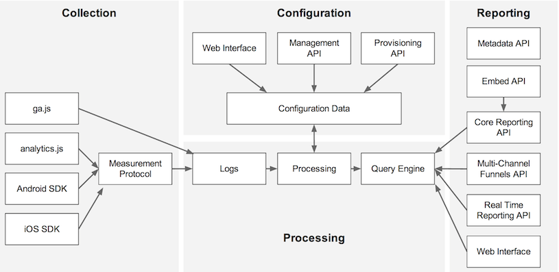
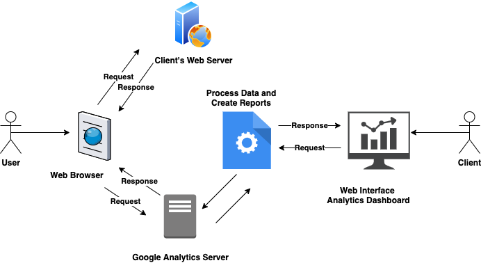
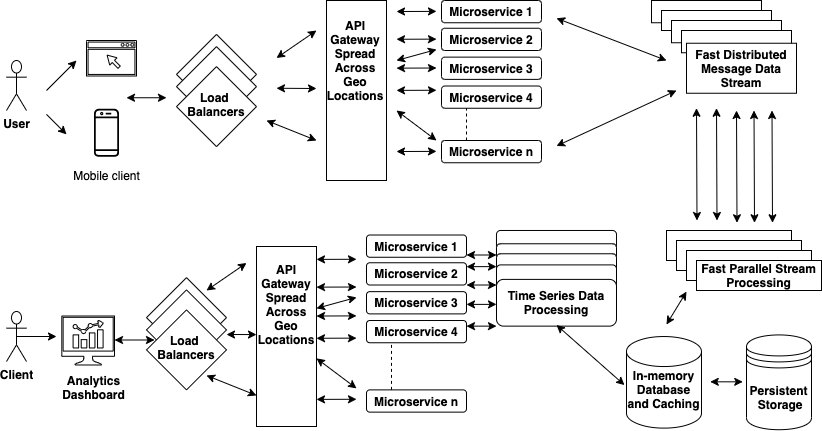

# Google Analytics High Level Backend Design. 
Design a Google Analytic like Backend System. We need to provide Google Analytic like services to our customers. Please provide a high level solution design for the backend system. Feel free to choose any open source tools as you want.

## Requirements
1. Handle large write volume: Billions of write events per day.
2. Handle large read/query volume: Millions of merchants wish to gain insight into their business. Read/Query patterns are time-series related metrics.
3. Provide metrics to customers with at most one hour delay.
4. Run with minimum downtime.
5. Have the ability to reprocess historical data in case of bugs in the processing logic.

### Google Analytics Basic Work Flow:

First lets understand the basic flow:

Image courtesy [Google](https://developers.google.com/analytics/devguides/platform/) 

#### There are four parts to the above flow, which can also be related to the Request/Response flow for User and Client provided below.

1. Collection: Client adds the Google Analytics script to there application web pages, which is used track and send User data to Google Analytics server.
This data is used to create reports.

2. Configuration: Client can configure and customize, what User data needs to be collected. 

3. Processing: The data sent to Analytics server is processed based on new or returning users, sessions and various other data sources.

4. Reporting:  Client can access the processed data, in form of infographics on Analytics Dashboard. 
  

Based on the above workflow diagram:
 - The client's web page has Google Analytics tracking code embedded. When a User sends a request to client's server, the web server will process this request and send back response. 
 - During page load GA async script gets executed from the tracking code in that page. This will extract details from cookies and sends request to GA server. For every user interaction an XHR (XMLHttpRequest) request is sent to analytics server.
 - Data is then processed and reports are created. 
 - Client can now access these reports from Analytics dashboard, which sends requests to the Query Engine. 
 
 ### High Level Design:
 The image below shows a high level design. 
 - The approach is based on Microservice architecture as this would allow the backend system to scale horizontally based on number of requests.
 - The distributed stream processing pipeline scales with load.
 
 
 
 #### Load Balancer:
-  The load balancer is an important component used in a distributed system. It distributes requests across a cluster of servers in order to improve the responsiveness and availability of the application, websites and databases. 
- Load balancer will also keep track of all application servers that are `UP` and block sending requests to the nodes, which are `DOWN` or affected.
- In above design the load balancer will distribute requests across the API gateway, which is spread across geo locations. 

#### Spring Boot/Cloud Microservices:
- The backend application would consist of Spring Boot and Cloud to build microservices. This will help to scale the services as required, microservices are small services that work together.
- For dynamic Scale Up and Down a combination of following could be used:
  - Naming Server (Eureka): Eureka for service discovery or manage routing rules, filters and load balancing across the system.
  - Ribbon (Client Side Load Balancing) 
  - Visibility and Monitoring:
    - Zipkin Distributed Tracing
    - Netflix API Gateway (Zuul): Zuul API gateway able to auto discover services registered in Eureka server.
  - Configuration Management:
    - Spring Cloud Config Server
  - Fault Tolerance:
    - Hystrix: Zuuk is integrated with Hystrix for fault tolerance.  
- Microservices approach improves resilience, scalability fault-tolerance and high availability. The deployment can be done into a Kubernetes cluster. The geographically spread API gateway routes requests from web to microservices registered in the load balanced Eureka.
- Microservices will ingest Message data to Kafka Streams data pipeline. 

#### Fast Distributed Message Data Stream :
[Apache Kafka](https://kafka.apache.org/) is a distributed event streaming platform used for high-performance data pipelines, steaming analytics, data integration and mission-critical applications. It aims to provide a unified, high-throughput, low-latency platform for handling real-time data feeds.

- High Throughput: Deliver messages at network limited throughput using a cluster of machines with latencies as los as 2ms.

- Scalable: Scale production clusters up to a thousand brokers, trillions of messages per day, petabytes of data, hundreds of thousands of partitions. Elastically expand and contract storage and processing.

- Permanent Storage: Store streams of data safely in a distributed, durable, fault-tolerant cluster.

- High Availability: Stretch clusters efficiently over availability zones or connect separate clusters across geographic regions.
- Other technologies to consider: Amazon Kinesis Data Stream.

#### Fast Parallel Stream Processing:
- [Apache Spark](https://spark.apache.org/streaming/) is a unified analytics engine for large-scale data processing. It achieves high performance for batch and streaming data, using a state-of-the-art DAG scheduler, query optimizer and a physical execution engine. Data access in HDFS, Alluxio, Apache Cassandra, Apache Hbase, Apache Hive. 
- Spark Streaming would process the Kafka data streams and create timeseries Ignite Resilient Distributed Datasets. Spark Streaming makes it easy to build scalable fault-tolerant streaming applications.
Other technologies to consider: Amazon Kinesis Firehose.

#### Time series Data Processing, In-memory Database and caching
- [Apache Ignite](https://ignite.apache.org/) is a horizontally scalable, fault-tolerant distributed in-memory computing platform for building real-time applications that can process terabytes of data with in-memory speed.
    - In-Memory Cache
    - In-Memory Data Grid
    - In-Memory Database
- Apache Ignite is designed for transactional, analytical, and streaming workloads, delivering in-memory performance at scale. Apache Ignite provides an implementation of the Spark timeseries Resilent Distributd Datasets which allows any data and state to be shared in memory as RDDs across Spark jobs. 
- The Ignite RDD provides a shared, mutable view of the same data in-memory in Ignite across different Spark jobs, workers, or applications.
- With Ignite, Spark users can configure primary and secondary indexes that can bring up to 1000x performance gains.

#### Persistent Storage:
- [Apache Cassandra](https://cassandra.apache.org/) is a distributed, wide column store, NoSQL database management system designed to handle large amounts of data across many commodity servers, providing high availability with no single point of failure.
- It provides scalability and high availability without compromising performance.
- Linear scalability and proven fault-tolerance on commodity hardware or cloud infrastructure make it the perfect platform for mission-critical data.
- Cassandra's support for replicating across multiple datacenters is best-in-class, providing lower latency for users and the peace of mind of knowing that one can survive regional outages.
- Ignite will perform persistent writes to Cassandra.

#### Analytics Dashboard:
The backend for dashboard is based on similar microservices approach. Apache Spark  will process the time series data shared in Apache Ignite and response will be sent back to dashboard. 
